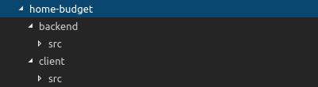

# Organizacja projektu

Nasz projekt będzie się składał tak naprawdę z dwóch niejako odrębnych aplikacji, które będą oczywiście się ze sobą komunikować. O komunikację między nimi zadbają nam odpowiednie serwisy AWS, ale jest to na razie dość odległa przyszłość. Myślę, że warto na razie po prostu zacząć od czegoś małego i sukcesywnie dobudowywać kolejne wersje programu.

### Struktura katalogów

Na temat właściwej struktury katalogów można by rozmawiać cały dzień, a i tak na koniec każdy będzie miał swoją rację. Nie ma tak naprawdę "najlepszej" odpowiedzi jak powinna ona wyglądać, po prostu każdy może sobie ułożyć ją po swojemu, byle by to wszystko miało jako tako ręce i nogi.  
Ja postanowiłem, że rozdzielę projekt na dwa podkatalogi: **backend** i **client**. **backend** będzie zawierał wszystko co związane z API, Serverless i GraphQL. **client**... no nie trzeba zbytnio chyba wyjaśniać, **client** to po prostu frontend naszej aplikacji, czyli generalnie mówiąc część kontrolowana przez React.js.

Ok, więc na chwilę obecną moja struktura katalogów wygląda tak:

### Inicjujemy backend

Kolejną rzeczą, którą musimy zrobić to zainicjować nasz projekt za pomocą yarn, jako że będziemy na pewno dodawać do niego dużo zależnych bibliotek więc narzędzie do obługi tych zależności jest tutaj niezbędne. Aby zainicjować projekt przechodzimy w terminalu do katalogu backend/ i wpisujemy po prostu` yarn init`:



