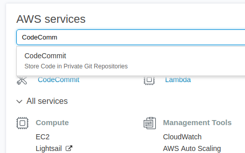
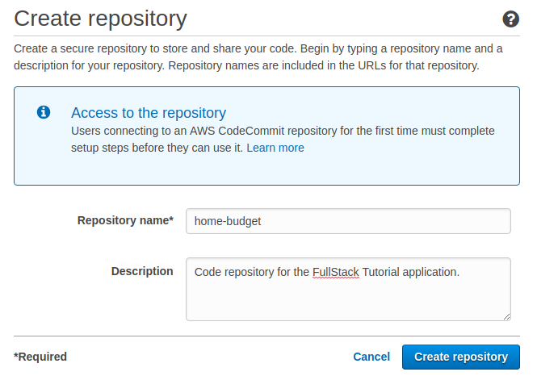
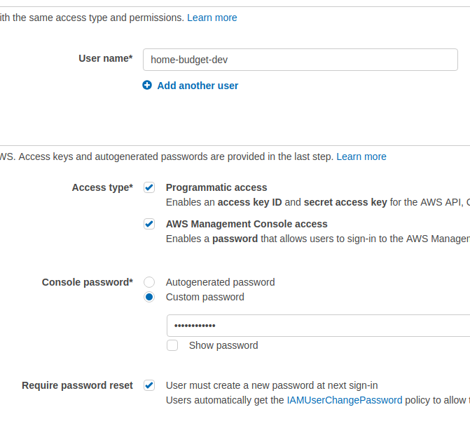
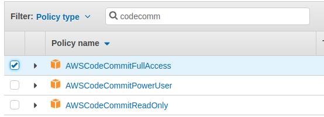
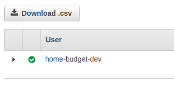
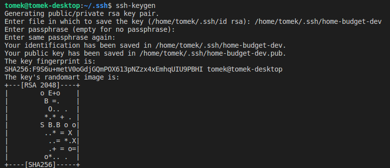
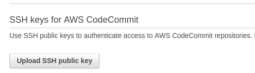
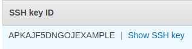
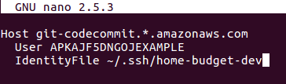

# AWS CodeCommit

### AWS CodeCommit czy GitHub?

Kolejną dobrą praktyką w sumie przy każdym projekcie, to system kontroli wersji kodu. Ja postanowiłem używać do tego celu Git, a jako repozytorium wybrałem jeden z serwisów AWS, a mianowicie **AWS CodeCommit**. Dlaczego nie **GiHub**? Po pierwsze, prawie każdy zna GitHub a w końcu tutorial polega na tym, żeby nauczyć się czegoś nowego. Po drugie i tak duża część naszej aplikacji będzie zależeć właśnie od różnych serwisów AWS więc uznałem, że kod projektu także chcę mieć zarządzany przez AWS - dzięki temu praktycznie cała aplikacja jest w jednym miejscu.

### Amazon Web Services Free Tier


Aby skorzystać z jakiegokolwiek serwisu AWS, należy zapisać się na tzw. Free Tier - jest to roczny okres, w którym większość usług oferowanych przez AWS mamy zupełnie za darmo. Zaznaczam jednak, że nie wszystko jest darmowe. I tak np. żeby ukończyć ten kurs, **nie mogę zagwarantować, że nie zapłacisz ani grosza**, jednak gwarantuję, że jeśli coś wyjdzie, to będą to sprawy właśnie groszowe, typu $0.5 - $1.0 miesięcznie. Więcej o Free Tier można znaleźć [tutaj](https://aws.amazon.com/free).


Nie będę opisywał tutaj jak zapisać się do Free Tier, bo naprawdę wystarczy wejść w podanego powyżej linka i proces rejectracji jest bardzo prosty.

### Tworzymy repozytorium w CodeCommit

Zakładam zatem, że masz już zarejestrowane i aktywne konto na AWS. Po zalogowaniu się do konsoli AWS po prostu wpisz w wyszukiwarce znajdującej się nad listą serwisów odpowiednią frazę:

Natępnie klikamy przycisk '**Create Repository**' i wypełniamy prosty formularz:

Pojawi nam się prośba o konfigurację SNS-a, czyli notyfikacji e-mailowych. Nie potrzebujemy tego na razie więc klikamy tutaj '**Skip**'. Po tym kroku nasze repozytorium powinno zostać utworzone pomyślnie.

### Dodawanie użytkownika z dostępem do repozytorium

Musimy teraz dodać nowego użytkownika z dostępem do repozytorium, jako że dostęp przez root-a jest niezalecany, już nie wspominając o tym, że dla root-a nie da się skonfigurować dostępu przez SSH, a tak właśnie chcemy komunikować się z naszym repo.

W tym celu należy odwiedzić [konsolę IAM](https://console.aws.amazon.com/iam/home) \(**Identity And Access Management**\). Z menu po lewej stronie wybieramy '**Users**', klikamy na '**Add User**' i dodajemy nowego użytkownika:

Następnie klikamy "**Next: Permissions**" i wybieramy "**Attach existing policies directly**". Pojawi nam się lista dostępnych reguł dostępu do poszczególnych serwisów. W wyszukiwarce wpisujemy "CodeCommit" i wybieramy "**AWSCodeCommitFullAccess**":

Teraz wystarczy tylko kliknąc w '**Next: Review**', a następnie '**Create User**'. Użytkownik zostanie utworzony. Na następnej stronie musimy pobrać plik .csv z danymi dostępowymi naszego użytkownika:

Są to tzw. "**Access key ID**" i "**Secret access key**" - oba potrzebne będą do uzyskania dostępu do serwisów AWS z poziomu lini poleceń. W przypadku dostępu do repozytorium musimy wykonać jeszcze jeden krok, a mianowicie wygenerować parę kluczy SSH za pomocą polecenia **ssh-keygen** w konsoli:

Po wygenerowaniu pary kluczy udajemy się ponownie do konsoli IAM, klikamy w '**Users**' a następnie w naszego nowego użytkownika. Wybieramy zakładkę '**Security credentials**', a następnie '**Upload public SSH key**', po czym odnajdujemy na naszym komputerze wygenerowany publiczny klucz SSH:

Po udanym uploadzie naszemu kluczowi zostanie przypisane unikalne "**SSH key ID**":

Kolejną rzeczą, którą należy wykonać, to edycja pliku **~/.ssh/config** \(jeśli takowego nie posiadasz, po prostu go utwórz w tej lokalizacji\) o takiej zawartości:

Oczywiście w miejsce ID klucza \(na screenie powyżej jest to "**APKAJF5DNGOJEXAMPLE**"\) należy podać swój **SSH key ID**, natomiast w miejscu **IdentityFile** ścieżkę do pliku z wygenerowanym kluczem prywatnym. Ostatnia rzecz, to zmiana ustawień dostępu dla pliku config, poprzez wykonanie z terminalu komendy:

`chmod 600 ~/.ssh/config`

Możemy teraz przetestować nasz dostęp do CodeCommit, poprzez polecenie

`ssh git-codecommit.eu-central-1.amazonaws.com`

Przy czym jeśli repozytorium CodeCommit zostało utworzone w innym rejonie, zamiast **eu-central-1 **należy podać odpowiedni rejon. Jeśli wszystko poszło zgodnie z planem powinniśmy zobaczyć wiadomość w stylu:

> You have successfully authenticated over SSH. You can use Git to interact with AWS CodeCommit.

