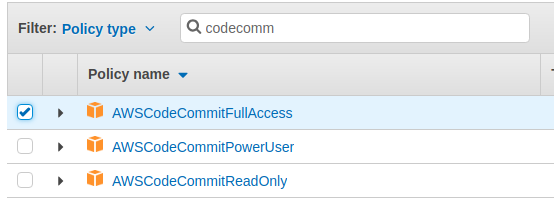
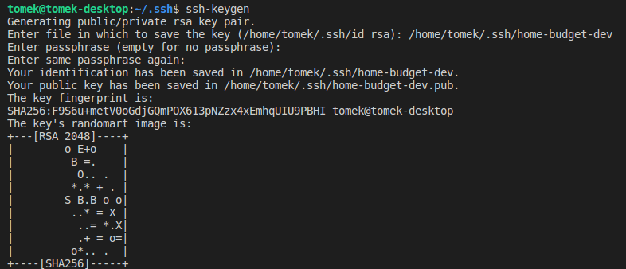
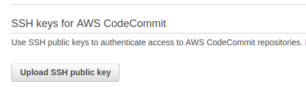
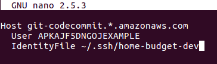

# Dodajemy nowego użytkownika w AWS

### Użytkownik z dostępem do repozytorium

Musimy teraz dodać nowego użytkownika z dostępem do repozytorium, jako że dostęp przez root-a jest niezalecany, już nie wspominając o tym, że dla root-a nie da się skonfigurować dostępu przez SSH, a tak właśnie chcemy komunikować się z naszym repo.

W tym celu należy odwiedzić [konsolę IAM](https://console.aws.amazon.com/iam/home) \(**Identity And Access Management**\). Z menu po lewej stronie wybieramy '**Users**', klikamy na '**Add User**' i dodajemy nowego użytkownika:

Następnie klikamy "**Next: Permissions**" i wybieramy "**Attach existing policies directly**". Pojawi nam się lista dostępnych reguł dostępu do poszczególnych serwisów. W wyszukiwarce wpisujemy "CodeCommit" i wybieramy "**AWSCodeCommitFullAccess**":

Teraz wystarczy tylko kliknąc w '**Next: Review**', a następnie '**Create User**'. Użytkownik zostanie utworzony. Na następnej stronie musimy pobrać plik .csv z danymi dostępowymi naszego użytkownika:

Są to tzw. "**Access key ID**" i "**Secret access key**" - oba potrzebne będą do uzyskania dostępu do serwisów AWS z poziomu lini poleceń. W przypadku dostępu do repozytorium musimy wykonać jeszcze jeden krok, a mianowicie wygenerować parę kluczy SSH za pomocą polecenia **ssh-keygen** w konsoli:

Po wygenerowaniu pary kluczy udajemy się ponownie do konsoli IAM, klikamy w '**Users**' a następnie w naszego nowego użytkownika. Wybieramy zakładkę '**Security credentials**', a następnie '**Upload public SSH key**', po czym odnajdujemy na naszym komputerze wygenerowany publiczny klucz SSH:

Po udanym uploadzie naszemu kluczowi zostanie przypisane unikalne "**SSH key ID**":

Kolejną rzeczą, którą należy wykonać, to edycja pliku **~/.ssh/config** \(jeśli takowego nie posiadasz, po prostu go utwórz w tej lokalizacji\) o takiej zawartości:

Oczywiście w miejsce ID klucza \(na screenie powyżej jest to "**APKAJF5DNGOJEXAMPLE**"\) należy podać swój **SSH key ID**, natomiast w miejscu **IdentityFile** ścieżkę do pliku z wygenerowanym kluczem prywatnym. Ostatnia rzecz, to zmiana ustawień dostępu dla pliku config, poprzez wykonanie z terminalu komendy:

`chmod 600 ~/.ssh/config`

Możemy teraz przetestować nasz dostęp do CodeCommit, poprzez polecenie

`ssh git-codecommit.eu-central-1.amazonaws.com`

Przy czym jeśli repozytorium CodeCommit zostało utworzone w innym rejonie, zamiast **eu-central-1 **należy podać odpowiedni rejon. Jeśli wszystko poszło zgodnie z planem powinniśmy zobaczyć wiadomość w stylu:

> You have successfully authenticated over SSH. You can use Git to interact with AWS CodeCommit.



