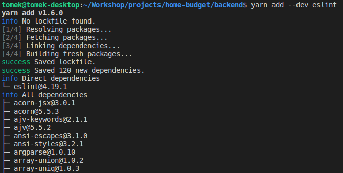
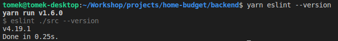

# ESLint

ESLint to świetne narzędzie usprawniające pracę programisty Javascript. Odpowiednio skonfigurowany będzie wyłapywał wszelkie błędy składniowe, zbędne bloki kodu, nieużywane importy, zmienne itd.  
Do tego każdy nowszy edytor kodu wykryje fakt, że ESLint jest skonfigurowany w naszym projekcie i również będzie wyświetlał nam komunikaty o błędach, wszelkiego rodzaju wskazówki itp.  
Aby go zainstalować wpisujemy w terminalu `yarn add --dev eslint`



Po instalacji musimy jeszcze minimalnie skonfigurować naszą nową bibliotekę. W tym celu tworzymy plik o nazwie `.eslintrc` w katalogu **backend/** o takiej zawartości:



```javascript
{
  "extends": "eslint:recommended",
  "parserOptions": {
    "ecmaVersion": 6
  },
  "env": {
    "node": true,
    "es6": true
  }
}
```



Jest to dobry punkt wyjściowy dla konfiguracji ESLint. Później dodamy kilka opcji, ale na razie powinno być OK.  
Musimy dodać także jeszcze jeden wpis w pliku package.json, a mianowicie utoworzyć nową sekcję o nazwie "scripts" w taki sposób:



```javascript
{
  "name": "backend",
  "version": "1.0.0",
  "description": "Backend for Home-Budget project",
  "main": "index.js",
  "license": "MIT",
  "scripts": {
    "eslint": "eslint ./src"
  },
  "devDependencies": {
    "eslint": "^4.19.1"
  }
}

```



W ten sposób instruujemy ESLint, żeby skanował tylko katalog ./src czyli ten z naszym kodem, a nie np. /node\_modules.

Możemy teraz przetestować instalację ESLint za pomocą komendy yarn eslint --version:






