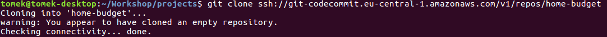
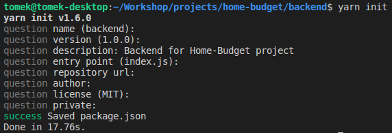

# Łączymy się z CodeCommit

Aby połączyć się i skolonować repozytorium utworzone w CodeCommit wykonujemy z linii poleceń następującą komendę:

```text
git clone ssh://git-codecommit.eu-central-1.amazonaws.com/v1/repos/home-budget
```

Oczywiście podając na końcu nazwę repozytorium, którą podaliśmy przy jego tworzeniu. Po wykonaniu tego polecenia nasze repozytorium powinno zostać zainicjowane na naszej lokalnej maszynie, do tego powinien zostać utworzony katalog home-budget oraz wyświetlona poniższa informacja:



Przechodzimy teraz do katalogu /home-budget i tworzymy następującą strukturę katalogów:


### Inicjujemy backend

Kolejną rzeczą, którą musimy zrobić to zainicjować nasz projekt za pomocą yarn, jako że będziemy na pewno dodawać do niego dużo zależnych bibliotek, więc narzędzie do obługi tych zależności jest tutaj niezbędne. Aby zainicjować projekt, przechodzimy w terminalu do katalogu **backend**/ i wpisujemy po prostu` yarn init`:



